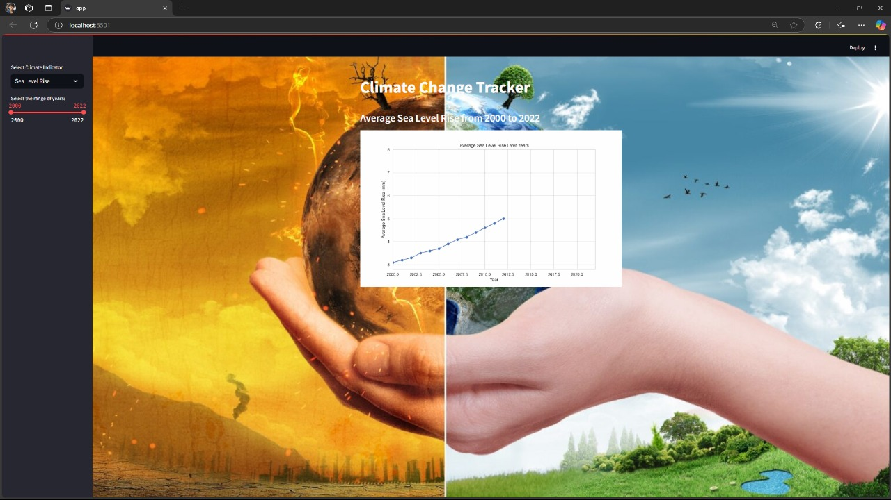
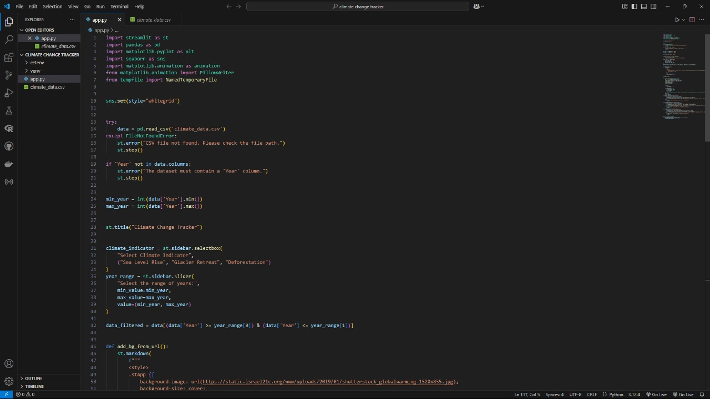

# 🌍 Climate Change Tracker


> An interactive climate change dashboard that visualizes real indicators like Sea Level Rise, Glacier Retreat, and Deforestation — built with Streamlit, Matplotlib, and Seaborn.

---

## 📌 Overview

**Climate Change Tracker** is a visually immersive web application that lets users explore how key climate indicators have changed over time. The app reads from a structured CSV dataset, allows filtering by indicator type and year range, and renders line charts directly in the browser.

The background design — a split image of a burning Earth vs a green Earth — makes the climate impact visually compelling, while the sidebar controls keep the interaction simple and intuitive.

---

## ✨ Features

| Feature | Description |
|---|---|
| 🌊 Climate Indicator Selector | Choose between Sea Level Rise, Glacier Retreat, and Deforestation |
| 📅 Year Range Slider | Dynamically filter data between any two years in the dataset |
| 📈 Line Chart Visualization | Auto-updating chart title and axes based on selected indicator and range |
| 🖼️ Background Theming | Full-screen split background image (burning Earth vs green Earth) via CSS injection |
| ⚠️ Error Handling | Graceful errors if CSV is missing or the Year column is not found |
| 🎨 Seaborn Whitegrid Style | Clean chart aesthetics using `sns.set(style="whitegrid")` |

---

## 🖼️ App Preview

### 📊 Live App — Sea Level Rise (2000 to 2022)


### 📟 Source Code


---

## 🔄 Workflow

```
┌──────────────────────────────────────────────────────┐
│               STREAMLIT APP STARTUP                   │
│         streamlit run app.py                          │
└─────────────────────┬────────────────────────────────┘
                      │
                      ▼
┌──────────────────────────────────────────────────────┐
│               DATA LOADING                            │
│   pd.read_csv('climate_data.csv')                     │
│   • Validates file exists (FileNotFoundError)         │
│   • Checks 'Year' column is present                   │
│   • Extracts min_year and max_year automatically      │
└─────────────────────┬────────────────────────────────┘
                      │
                      ▼
┌──────────────────────────────────────────────────────┐
│               SIDEBAR CONTROLS                        │
│   • st.sidebar.selectbox → Climate Indicator          │
│     (Sea Level Rise / Glacier Retreat /               │
│      Deforestation)                                   │
│   • st.sidebar.slider → Year Range                    │
│     (min_year to max_year, default = full range)      │
└─────────────────────┬────────────────────────────────┘
                      │
                      ▼
┌──────────────────────────────────────────────────────┐
│               DATA FILTERING                          │
│   data_filtered = data[                               │
│     (data['Year'] >= year_range[0]) &                 │
│     (data['Year'] <= year_range[1])                   │
│   ]                                                   │
└─────────────────────┬────────────────────────────────┘
                      │
                      ▼
┌──────────────────────────────────────────────────────┐
│               VISUALIZATION                           │
│   • Dynamic chart title:                              │
│     "Average {indicator} from {start} to {end}"       │
│   • Matplotlib line plot on filtered data             │
│   • Seaborn whitegrid style                           │
│   • Rendered via st.pyplot()                          │
└─────────────────────┬────────────────────────────────┘
                      │
                      ▼
┌──────────────────────────────────────────────────────┐
│               UI RENDERING                            │
│   • st.title() → "Climate Change Tracker"             │
│   • Full-screen background via CSS (add_bg_from_url)  │
│   • Chart displayed in main panel                     │
└──────────────────────────────────────────────────────┘
```

**Step-by-step:**

1. **Startup** — `app.py` is launched via `streamlit run app.py`. Seaborn style is set globally.
2. **Load** — `climate_data.csv` is read using Pandas. The app validates the file and the `Year` column before proceeding.
3. **Min/Max Detection** — `min_year` and `max_year` are auto-detected from the dataset so the slider adapts to any date range.
4. **Sidebar Input** — User selects a climate indicator from a dropdown and adjusts the year range using a slider.
5. **Filter** — The DataFrame is filtered using boolean masking on the `Year` column based on the slider values.
6. **Plot** — A Matplotlib line chart is generated with a dynamic title reflecting the selected indicator and year range.
7. **Background** — `add_bg_from_url()` injects custom CSS via `st.markdown()` to apply the split Earth background image.
8. **Render** — The final chart is displayed using `st.pyplot()` inside the themed Streamlit page.

---

## 🏗️ Architecture

```
climate-change-tracker/
│
├── app.py                  # Main Streamlit app — all logic in one file
├── climate_data.csv        # Climate dataset (Year + indicator columns)
├── requirements.txt        # Python dependencies
│
├── ccenv/                  # Virtual environment (do not commit)
├── venv/                   # Alternate venv (do not commit)
│
├── graph_image.jpeg        # App screenshot for README
├── code_snippet.jpeg       # Code screenshot for README
│
└── README.md
```

**Component breakdown:**

| Component | Role |
|---|---|
| `app.py` | Single-file Streamlit app — data load, filter, plot, background, UI |
| `climate_data.csv` | Input CSV with `Year` column + one column per climate indicator |
| `add_bg_from_url()` | Injects CSS `background-image` using `st.markdown(unsafe_allow_html=True)` |
| `st.sidebar.selectbox` | Dropdown for choosing the climate indicator |
| `st.sidebar.slider` | Dual-handle slider for selecting year range |
| `st.pyplot()` | Renders the Matplotlib figure inside Streamlit |

**Design decisions:**
- **Single-file architecture** — All logic lives in `app.py` for simplicity and portability.
- **Dynamic slider bounds** — `min_year` and `max_year` are read from the data, so the app works with any date range without hardcoding.
- **CSS background injection** — Streamlit's `st.markdown()` with `unsafe_allow_html=True` is used to apply a full-screen background image from a remote URL.
- **Error-first loading** — The app checks for missing files and missing columns before rendering anything, preventing silent failures.

---

## 📂 Dataset — `climate_data.csv`

### Schema

| Column | Type | Unit | Description |
|---|---|---|---|
| `Year` | int | — | Year of observation (e.g. 2000–2022) |
| `Sea Level Rise` | float | mm | Average global sea level rise |
| `Glacier Retreat` | float | km² | Area of glacier lost per year |
| `Deforestation` | float | Mha | Million hectares of forest lost |

### About the data

- **Range:** 2000 to 2022 (23 years of records).
- **Type:** Synthetically generated to mimic real-world trends for demonstration.
- **Schema inspiration:** Based on datasets from NASA, NOAA, and Global Forest Watch.
- **Column naming matters** — The `selectbox` options (`"Sea Level Rise"`, `"Glacier Retreat"`, `"Deforestation"`) must exactly match the column names in the CSV for the chart to render correctly.

### Replacing with real data

| Source | Indicator | Link |
|---|---|---|
| NASA GSFC | Sea Level Rise (satellite altimetry) | [sealevel.nasa.gov](https://sealevel.nasa.gov/understanding-sea-level/key-indicators/global-mean-sea-level) |
| NSIDC | Glacier Mass Balance | [nsidc.org](https://nsidc.org/data/glaciers) |
| Global Forest Watch | Deforestation / Tree Cover Loss | [globalforestwatch.org](https://www.globalforestwatch.org/) |
| NOAA | Climate Indicators Dashboard | [climate.gov](https://www.climate.gov/maps-data) |

> ⚠️ When replacing the CSV, make sure the column headers exactly match the options in `st.sidebar.selectbox` inside `app.py`.

---

## 🚀 Installation

```bash
# 1. Clone the repository
git clone https://github.com/Hari0990/climate-change-tracker.git
cd climate-change-tracker

# 2. Create and activate a virtual environment
python -m venv venv
source venv/bin/activate        # macOS/Linux
venv\Scripts\activate           # Windows

# 3. Install dependencies
pip install -r requirements.txt

# 4. Run the app
streamlit run app.py
```

The app opens automatically at `http://localhost:8501`.

---

## 🧪 Usage

1. Open the app at `http://localhost:8501`.
2. Use the **Select Climate Indicator** dropdown in the sidebar to choose `Sea Level Rise`, `Glacier Retreat`, or `Deforestation`.
3. Drag the **year range slider** to narrow or expand the time window.
4. The chart title and plot update instantly to reflect your selection.

---

## 🛠️ Tech Stack

| Layer | Technology |
|---|---|
| Frontend / UI | Streamlit |
| Data Handling | Pandas |
| Visualization | Matplotlib, Seaborn |
| Animation | Matplotlib FuncAnimation, PillowWriter |
| Background Styling | CSS via `st.markdown()` |
| Language | Python 3.9+ |

---

## 📦 Requirements

```txt
streamlit
pandas
matplotlib
seaborn
pillow
tempfile
```

Install all at once:
```bash
pip install streamlit pandas matplotlib seaborn pillow
```

---

## 🌐 Live Demo

> 🔗 **[Live App →](https://your-streamlit-app-url.streamlit.app)**
> *(Deploy free at [Streamlit Community Cloud](https://streamlit.io/cloud))*

---

## 📄 License

This project is licensed under the **MIT License**.

---

## 👤 Author

**Hari** — AI & Robotics Developer  
[](https://github.com/Hari0990)
[]([https://linkedin.com/in/your-profile](https://www.linkedin.com/in/bellamkonda-harithreenath-906665287?utm_source=share&utm_campaign=share_via&utm_content=profile&utm_medium=android_app)

---

<p align="center">Made with ❤️ and Coffee 😁</p>
